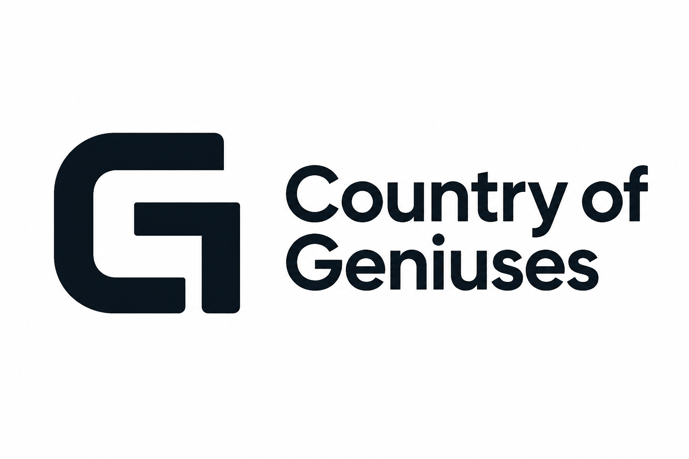

# Country of Geniuses

Open-source agent harness for civic problem discovery and responsible work with public services.

  

> Give an agent a territory, a problem area, and this repository. It gains reusable skills, local context, integration knowledge, and a safe way to turn findings into human-reviewed action.

## The idea

People often stop before contacting a public service because the responsible organization, required evidence, language, or submission path is unclear. Country of Geniuses collects the reusable knowledge that helps an agent cross that gap.

The participant launches the agent. The repository does not run a central crawler, queue, daemon, or autonomous complaint service. A participant can ask an agent to investigate a bounded territory and problem area, or can bring a personal problem to the same workflow.

## Two ways to use the harness

1. **Proactive investigation**: tell an agent to look for current public-service problems in a bounded city, territory, topic, and time window.
2. **User request**: ask an agent to help with a concrete problem and identify the right public service.

Both modes use the same flow:

`signal -> verify -> deduplicate -> route -> prepare -> human confirmation -> submit -> track -> verify outcome`

The first release focuses on investigation and preparation. The repository itself is the harness. A future runtime may automate selected parts, but no runtime is required to start contributing value.

## An open community

Country of Geniuses is intentionally an open-by-default community project. We are looking for honest, concrete, and checkable signals from people who know their local context. A useful signal can help us grow the public knowledge base and improve the skills, jurisdiction packs, and integration guidance in this repository.

You do not need to be a developer. Share what happened, where and when it was observed, which public sources support it, whether an existing request is already known, and what a useful next step would be. We will verify the signal before treating it as a case and will publish only the minimum redacted information needed for others to learn from it.

Start with the [Civic signal issue form](https://github.com/mashingaan/country-of-geniuses/issues/new?template=signal.yml). Honest uncertainty is welcome. Fabricated, abusive, identifying, or spam signals are not useful to the commons.

## What is inside

| Path | Purpose |
| --- | --- |
| `skills/` | Agent skills that define investigation steps and stop conditions |
| `schemas/` | Machine-readable, privacy-safe public artifacts |
| `examples/` | Fictional examples for agents and contributors |
| `jurisdictions/` | Country and city context packs |
| `integrations/` | API and MCP knowledge, contracts, and verification status |
| `assets/branding/` | Project logo, GitHub avatar, and generation prompts |
| `docs/` | Architecture, workflow, safety, and community guidance |
| `docs/research/` | Dated research leads and source-backed patterns |
| `scripts/` | Small local checks for repository consistency |

## Current status

This is the first foundation increment. It contains the harness model, one reusable civic triage skill, a problem-card schema, contribution rules, safety boundaries, one dated Boston read-only pack, and one prepared San Francisco accessibility case.

The integration registry remains empty by design. The Boston and San Francisco packs document read-only evidence and make no write claim. The [San Francisco case](examples/san-francisco-muni-elevator.json) demonstrates a current public problem, a bounded no-duplicate check, correct routing, and a draft that still needs human confirmation. No government endpoint is presented as live for submission until a contributor documents and verifies it. The next milestone is a narrow, non-emergency pilot with a human approving every external action.

## Quick start

1. Read `AGENTS.md`.
2. Read `docs/trust-and-safety.md`.
3. Load `skills/civic-problem-triage/SKILL.md` into your agent.
4. Give the agent a bounded territory, topic, and time window.
5. Keep private evidence, credentials, and drafts outside this repository.

For a new jurisdiction, start with `jurisdictions/README.md`. For a connector or MCP server, start with `integrations/README.md`.

## Validate

Install the development dependency once with `python -m pip install -r requirements-dev.txt`, then run `python scripts/validate-repo.py` or `powershell -ExecutionPolicy Bypass -File scripts/validate-repo.ps1`. The check validates all public examples against the full JSON Schema and runs negative regression cases for invalid statuses, empty evidence, missing jurisdiction, discarded cards without a stop reason, and unverified closed outcomes.

## Trust model

- Public code and public process do not make private data public.
- A source is evidence, not proof that a problem is current or that a service will act.
- Every external submission requires explicit human confirmation in the first releases.
- A closed ticket is not the same as a verified fix.
- Duplicate detection and rate limiting are part of correctness.
- The project does not rank countries, accuse people, or automate legal, emergency, medical, or law-enforcement decisions.

Read the full policy in `docs/trust-and-safety.md`.

## Contributing

Useful contributions include a tested local service map, a source-quality note, an integration contract, a reproducible public case, a translation, or a correction to an existing procedure.

Start with `CONTRIBUTING.md`. Keep pull requests narrow and include the evidence and verification boundary for every claim.

See `ROADMAP.md` for the staged path from a repository harness to optional runtime support.

## License

The repository is released under the MIT License. See `LICENSE`.
